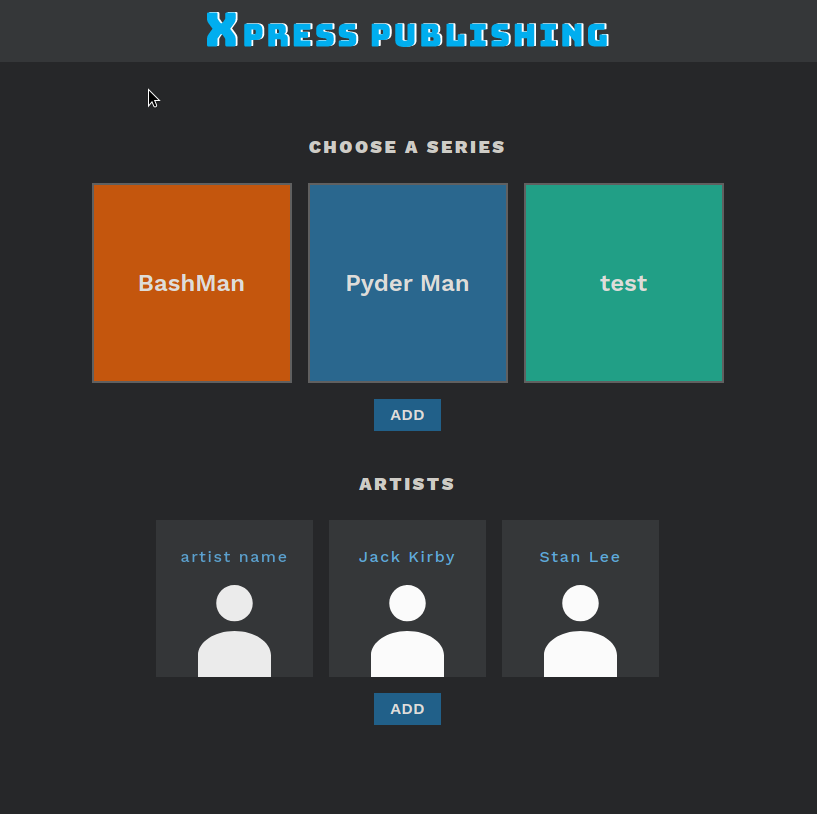
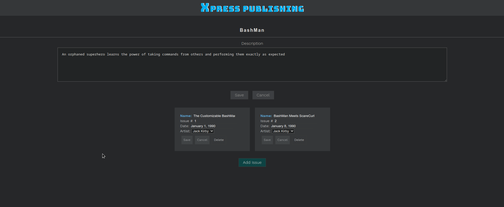

# X-Press Publishing
### Table of contents
* [Project_Overview](#project_Overview)
* [Tech_Stack](#tech_stack)
* [Screenshots](#screenshots)
* [Contact](#contact)

### Project_Overview

Learning project from CodeCademy. My goal was to implement backend (node.js with SQLite 3). I had tasks and tests, and I had to implement all endpoints and check tests.  

### Tech_Stack
* node.js
* SQLite 3

### Screenshots

## Contact
Back End created by:
* [Gaudnik Wojciech](mailto:gaudnik.wojciech@gmail.com) - feel free to contact me! 